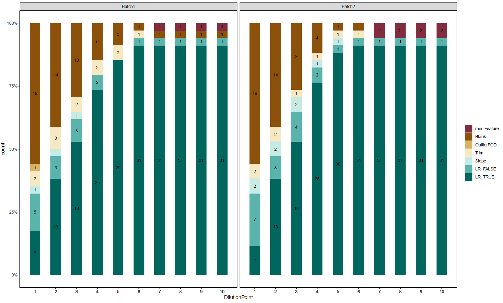
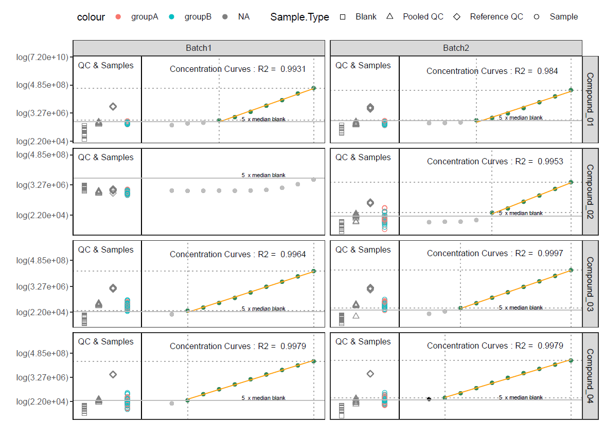
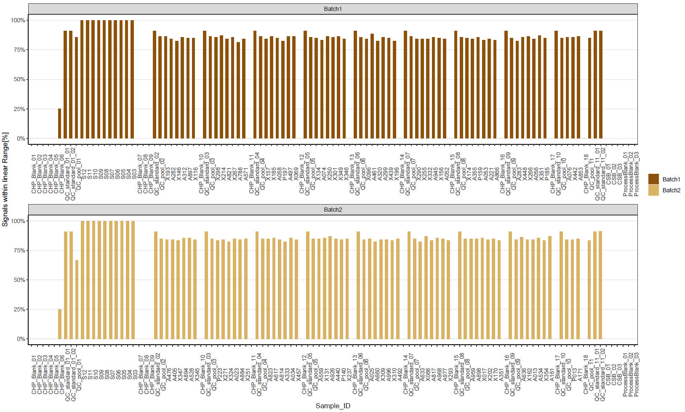

---
---
---

# MSlineaR

Thank you for your interest on MSlineaR. If you use it please cite:

**Janine Wiebach, Ulrike Bruning, Álvaro Fernández-Ochoa, Jochen Kruppa-Scheetz, Maëlle Bonhomme, Dominique Votion, Jennifer Kirwan "MSlineaR software: a new R package assessing linearity to improve quality assurance and statistical robustness in untargeted metabolomics" paper in preparation**

`MSlineaR` is a dataset tool to reduce the risk of false positives by limiting datasets to only high quality data (in combination with other more standard filtering steps such as with RSD or D-ratios). It reduces a dataset to only those signals that show a clear linear response in signal when the concentraton is increased. It requires a dataset which includes either serial concentrated or diluted compounds. It can be used for targeted and untargeted metabolomic data sets. In short the package use a serial diluted or concentrated data set to determine the linear portion of the dilution/calibration curve. Therefore the following steps will be performed:

1.  The data will be checked and transformed.

2.  The minimal lower limit of quantification will be determined using a blank and a user defined signal to blank ratio.

3.  Outliers will be detected using three curve fitting models.

4.  The beginning and end of dilution/calibration curve will be trimmed, so that the first point of the potential linear curve has the lowest intensity and the last point potential linear curve should have the largest intensity.

5.  A second outlier detection will be performed using the three curve fitting models.

6.  Reducing the curve to only consecutive points which showing a positive slope.

7.  Determining the linear part of the curve by using a linear regression model. Only curves with an Coefficient of Determination (R²) higher or equal to a predefined R² are considered as linear.

8.  If the data set consists of several batches, the algorithm checks if a linear part was found in all batches. If not than the compound will be flagged and if requested can be removed.

After these steps for each dilution/concentration curve are the information available about if the respective compound has a linear part and and where it starts and ends. With these information the signals of biological samples can be classified into signals which are in the linear range and signals which are outside of the linear range.

## Installation

`MSlineaR` requires GNU R version \>= 4.1.2 installed.

To get the latest development version from `MSlineaR` from [GitHub](https://github.com/) you can use the [`devtools`](https://github.com/r-lib/devtools) package:

``` r
# install.packages("devtools")
devtools::install_github("bih-metabolomics/MSlineaR")
```

As long as `MSlineaR` is not a public package, you need to have access to my repository and additionally you need create a personal access token in github. Ask me if you have trouble with installing the package.

Install `MSlineaR` by running the following commands in R:

```         
if (!requireNamespace("usethis")) install.packages("usethis")
  
# set config
# add github user name and email adress, which you are using for github
usethis::use_git_config(user.name = "USERNAME", user.email = "EMAIL")

#Go to github page to generate token only for first time
usethis::create_github_token()

#paste your PAT into pop-up that follows...
credentials::set_github_pat()

# install.packages("devtools")
devtools::install_github("bih-metabolomics/MSlineaR")
```

## Input Data Tables

An example dataset is given at the bottom of this file.
MSlineaR needs two tables as input, one with information about the features and one for the sample meta data.

### **1) Feature Table**

The Feature table should be present in long format with following columns:

-   mandatory: Identification of the samples -\> the column name must be identical in both tables

-   mandatory: Identification of the compounds

-   mandatory: Instrument response( y) , e.g. Area, Intensity etc

-   mandatory: Identification of the Batch -\> the column name must be identical in both tables

| Sample.Identification | Compound  |  Area  | Batch |
|:---------------------:|:---------:|:------:|:-----:|
|          s25          | compound1 | 157898 |  B1   |
|          s25          | compound2 | 13578  |  B1   |
|          s25          | compound3 | 136789 |  B1   |
|         cal1          | compound1 | 23654  |  B1   |
|         cal1          | compound2 |  7856  |  B1   |
|         cal1          | compound3 | 96347  |  B1   |
|         cal1          | compound1 | 23659  |  B2   |
|         cal1          | compound2 |  8856  |  B2   |
|         cal1          | compound3 |  9634  |  B2   |

: example for feature table

**Reformating table from wide into long format**

Many peakpicking software, e.g. xcms, providing the data in wide format. The data can be easily reformated into long format using following code:

``` r
library(tidyr)
library(dplyr)

feature_tlb_wide <- MSlineaR::Feature_tlb_wide

feature_tbl_long <- feature_tlb_wide |> 
pivot_longer(cols = c("Compound_01" : "Compound_34"),, names_to = "Compound", values_to = "Area")
```

### **2) Sample Table**

The Sample Table contains all meta data for the individual samples. The table needs to be present in long format and should contain the following columns:

-   mandatory: identification of the samples -\> the column name must be identical in both tables

-   mandatory: type of samples, e.g. calibrants, samples, pooled QC etc

-   mandatory: order of injection

-   mandatory: dilution step normalized to the highest dilution i.e. the most dilute sample is given a dilution factor of 1. If the dilution factor is 3 (i.e. every sample is 3 times more dilute than its nearest neighbour), than the second most dilute sample is termed 3, the next one 9 , the next one 27,...This process also allows for uneven dilution steps between dilution points

-   mandatory: Identification of the Batch -\> the column name must be identical in both tables

-   optional statistical group for the biological samples

-   Additional columns will be ignored for calculations, but will be present in the final output.

| Sample.Identification | Sample.Type | Sequence.Position | Dilution | Batch | Group  |
|:---------------------:|:-----------:|:-----------------:|:--------:|:-----:|:------:|
|        blank1         |    blank    |         1         |    NA    |   1   |   NA   |
|         cal1          |  dilution   |         5         |    1     |   1   |   NA   |
|          QC1          |  pooledQC   |         6         |    3     |   1   |   NA   |
|          s25          |   sample    |        12         |    NA    |   1   | groupA |
|          s14          |   sample    |        13         |    NA    |   1   | groupB |
|         cal1          |  dilution   |         5         |    1     |   2   |   NA   |

: example how the sample table should look like

## Input Arguments for function `AssessLinearity`

-   *output_name*: name of the output file

-   *output_dir*: directory where the output files should be saved
   
-   *analysisType:* You can choose between "targeted" or "untargeted"

-   *inputData_feature*: Data table or data frame with at least three columns, see above

-   *inputData_sample*: Data table or data frame with at least four columns, see above

-   *column_sampleType*: Column name in *inputData_sample* which indicates the sample types of the data set (default = "Sample.Type). Following sample types needs to provided:

    -   *sampleType_serial*: Sample type of the serial diluted or concentrated samples (default = "Dilution")

    -   *sampleType_sample*: Sample type of the measured (biological) samples (default = "Sample", disabled = NULL)

    -   *sampleType_blank*: Sample type of the blank sample, which will be used for the signal to noise calculation (default = "Blank", disabled = NULL). This parameter could include a vector with more sample types, e.g. c("ProcessBlank", "SolventBlank"). Each of the sample with these sample types will be used for signal to noise determination.

    -   *sampleType_QC*: Sample types of the QC samples (default = "QCpool", disabled = NULL). This parameter could include a vector with more sample types.

-   *column_sampleID*: Column name in *inputData_feature* and *inputData_sample* indicating a unique sample identifier per Batch (default = "Sample.Identifiaction").

-   *column_featureID*: Column name in *inputData_feature* indicating a unique feature identifier (default = "CompoundID")

-   column_injectionOrder: Column name in *inputData_sample* indicating the sequence order of the samples (default = "Sequence.Position")

-   *column_batch:* Column name in *inputData_feature* and *inputData_sample* indicating a unique Batch identifier (default = "Batch")

-   *column_X*: Column name in *inputData_sample* indicating the single dilution of the serial diluted samples (default = "Dilution")

-   *column_Y*: column in *inputDat*a_feature indicating the Instrument response, e.g. Area, Intensity (default = "Area")

-   *column_sampleClass*: optional Column name in *inputData_sample* indicating the statistical class for the measured samples (default = "Group", disabled = NULL).

-   *signal_blank_ratio*: The ratio which will be used for signal to blank assessment. (default = 5, disabled = NULL). According to EMA guidelines 2012, the signal should be at least 5 times the the signal of a blank sample.

-   *min_feature:* Minimal number of consecutive signals present per dilution/concentration curve, to consider this curve as linear (default = 6, according to EMA guidelines 2012)

-   *R2_min:* Minimum coefficient of determination, which needs to be reached to consider the signal as linear (default = 0.9)

-   *n_core*: How many cores should be used for parallel processing (default = 1)

### With these arguments MSlineaR can run the example data set:

The example data set is an targeted data set with 34 metabolites measured in two batches :

-   680 Calibration Standard signals ( 34 metabolites a two batches a 10 concentrations)
-   1020 Blank signals (34 metabolites a two batches a 15 repeats)
-   748 pooled QC signals (34 metabolites a two batches a 11 repeats)
-   884 Reference QC signals (34 metabolites a two batches a 13 repeats)
-   3434 biological sample signals ( 34 metabolites a 101 patients)

The 101 biological samples were randomly assigned to either statistical group "groupA" (n = 45) or "groupB" (n = 56) .

``` r
library(MSlineaR)

# load example data
data_tbl_feature <- MSlineaR::Feature_tbl_long
data_tbl_sample  <- MSlineaR::Sample_tbl


targetedMSCal <- MS_AssessLinearity(
  output_name = "Test_targeted",
  output_dir = "Test",
  analysisType ="targeted",
  inputData_feature = data_tbl_feature,
  inputData_sample = data_tbl_sample,
  column_sampleType = "Sample.Type",
    sampleType_QC = c("Pooled QC","Reference QC"),
    sampleType_sample = "Sample",
    sampleType_serial = "Calibration Standard",
    sampleType_blank = "Blank",
  column_sampleID = "Sample.Identification",
  column_featureID = "Compound",
  column_injectionOrder = "Sequence.Position",
  column_batch = "Batch",
  column_X = "Dilution",
  column_Y = "Area",
  column_sampleClass = "Group",
  signal_blank_ratio = 5,
  min_feature = 5,  
  nCORE = 4
)
```

## Results

MSlineaR creates multiple output files.

1.) CSV Files

Three csv files are present.

-   In the file "*date_output_name*\_result.csv" all informations from the input files are present in long format plus the column "Status_LR" , which indicates if the samples are below limit of linearity (BLOL), within the linear range (TRUE), upper the linear range (ULOL) or the compound did not show a linear range (FALSE or NA).

-   In the file "*date_output_name*\_Concentration Curves_featureBased.csv" are the information of the serial data available for the separate steps on a signal basis.

-   In the file "*date_output_name*\_Concentration Curves_signalBased.csv" are the information of the serial data available for the separate steps on a compound basis.

2.) .Rdata File

One R-image file is present containing all tables, which enables the user to store all data in one file.

3.) log file

During each run of MSlineaR a log file is created storing the used system parameters and time range which was needed for each function.

4.) images

MSlineaR creates 5 pdf files.

-   The file "*date_output_name*\_Summary_Calibration_Barplot.pdf" shows an overview about the linearity of all compounds at each dilution step and at which step they were chucked out. The figure can be used to decide if one dilution step did not worked really well, e.g. due to a misinjection and at which dilution most of the compounds show a good linearity.

    

-   The file "*date_output_name*\_Summary_CalibrationPlot.pdf" shows all dilution /concentration curves separately. If the data have more than 50 features, 50 features were randomly used for the plot. On the left side of each plot are the QCs and samples and on the right side is the dilution series. The dashed lines showing the limits of the linear range. Green points are considered to be within the linear range, black points are valid but outside of the linear range and grey points were chucked out. The samples are colored according to their biological class.

    

-   The file "*date_output_name*\_Summary_Barplot_all.pdf" displays the amount of linear compounds within each sample ordered according to the injection order. This plot can be used to see if there is an carry over or contamination within the blanks and if there is a systematic drift, which could indicate that there is a issue with the detection. In this example there is a clear contamination in CHP_Blank_06 in both batches oberservable and QC_pool_01 of batch 2 shows a lower amount of linear features compared to the other pooled QCs.



-   File "*date_output_name*\_Summary_Barplot_Samples.pdf" and "*date_output_name*\_Summary_Barplot_QC.pdf" show the same but only for the biological samples and QC respective and are ordered and colored according to the statistical group or different types of QCs.

## Complete Input Arguments for function `AssessLinearity` :

The function provides the possibility to disable each step separately and to change the settings for each step.

1)  Input data

-   *inputData_feature*: Data table or data frame with at least three columns, see above

-   *inputData_sample*: Data table or data frame with at least four columns, see above

-   *column_sampleType*: Column name in *inputData_sample* which indicates the sample types of the data set (default = "Sample.Type). Following sample types needs to provided:

    -   *sampleType_serial*: Sample type of the serial diluted or concentrated samples (default = "Dilution")

    -   *sampleType_sample*: Sample type of the measured (biological) samples (default = "Sample", disabled = NULL)

    -   *sampleType_blank*: Sample type of the blank sample, which will be used for the signal to noise calculation (default = "Blank", disabled = NULL). This parameter could include a vector with more sample types, e.g. c("ProcessBlank", "SolventBlank"). Each of the sample with these sample types will be used for signal to noise determination.

    -   *sampleType_QC*: Sample types of the QC samples (default = "QCpool", disabled = NULL). This parameter could include a vector with more sample types.

-   *column_sampleID*: Column name in *inputData_feature* and *inputData_sample* indicating a unique sample identifier per Batch (default = "Sample.Identifiaction").

-   *column_featureID*: Column name in *inputData_feature* indicating a unique feature identifier (default = "CompoundID")

-   *column_batch:* Column name in *inputData_feature* and *inputData_sample* indicating a unique Batch identifier (default = "Batch")

-   *column_X*: Column name in *inputData_sample* indicating the single dilution of the serial diluted samples (default = "Dilution")

-   *column_Y*: column in *inputDat*a_feature indicating the Instrument response, e.g. Area, Intensity (default = "Area")

-   *column_sampleClass*: optional Column name in *inputData_sample* indicating the statistical class for the measured samples (default = "Group", disabled = NULL)

2)  transforming the data

-   *transform*: Should the data be transformed? Default = TRUE

    -   *transform_x*: Which transformation method should be used ? (default= "log")

    -   *inverse_x*: Which method reverse the used transformation method? (default= "exp")

    -   *transform_y*: Which transformation method should be used? (default= "log")

*inverse_y*: Which method reverse the used transformation method? (default= "exp")

3)  Signal to noise

The signal to noise assessment will be performed on the non transformed data if the parameters *signal_blank_ratio* and *sampleType_blank* area not NULL.

-   *signal_blank_ratio*: The ratio which will be used for signal to blank assessment. (default = 5, disabled = NULL). According to EMA guidelines 2012, the signal should be at least 5 times the the signal of a blank sample.

4.  First outlier detection

-   first_outlier_detection: Should the outlier detection be performed? (default = TRUE, disabled = FALSE)

    -   FOD_model: Which model should be used for the outlier detection? Currently supported are linear regression ("linear"), quadratic regression ("quadratic") and logistic regression ("logistic"). Default is a vector with all three models (default = c("logistic", "linear", "quadratic").

    -   FOD_sdres_min: Minimum residual standard deviation of a statistical model. If the residual standard deviation is below this value, there will be no outlier detection performed for this signal. (default = 1).

    -   FOD_stdres_max : Maximum value for standardized residuals of a statistically model. If a standardized residual is above this value, this point will be considered as outlier and removed for further procedere. (default = 2).

5.  Curve trimming

-   trimming: Should the data be trimmed? (default = TRUE)

6.  Second outlier detection

-   second_outlier_detection: Should the outlier detection be performed? (default = TRUE, disabled = FALSE)

    -   SOD_model: Which model should be used for the outlier detection? Currently supported are linear regression ("linear"), quadratic regression ("quadratic") and logistic regression ("logistic"). Default is a vector with all three models (default = c("logistic", "linear", "quadratic").

    -   SOD_sdres_min: Minimum residual standard deviation of a statistical model. If the residual standard deviation is below this value, there will be no outlier detection performed for this signal. (default = 1).

    -   SOD_stdres_max : Maximum value for standardized residuals of a statistically model. If a standardized residual is above this value, this point will be considered as outlier and removed for further procedere. (default = 2).

7.  Determining linear range

-   LR_sd_res_factor : Multiplication factor for the standard deviation of standardized residuals from the linear model. All standardized residuals which are within the range of standardized residuals +/- sd standardized residuals \* LR_sd_res_factor are considered as linear. (default = 3).

-   R2_min : Minimum coefficient of determination, which needs to be reached to consider the signal as linear (default = 0.9).

8.  other parameters

-   *min_feature:* Minimal number of consecutive signals present per dilution/concentration curve, to consider this curve as linear (default = 6, according to EMA guidelines 2012)

-   *n_core*: How many cores should be used for parallel processing (default = 1)

8.  Output

-   get_output: Should the output be exported? (default = TRUE)

-   which_output: Should all type of Output be exported? The user can decide between "all", "R_object", "DilutionCurves", "BiologicalSamples" and "Plots". (default = "all")

-   *output_name*: Prefix name of the output file

-   *output_dir*: Directory where the output files should be saved
